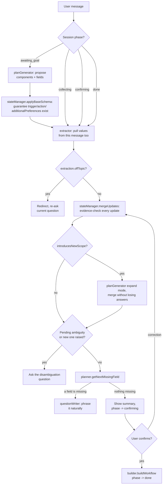

# Conversational Workflow Builder

A chatbot that turns a natural-language automation request (any domain — "notify
finance when an invoice arrives", "build a CI/CD pipeline for my app") into a
structured workflow (nodes + edges), the way n8n's planning experience works.

**This is planning and representation only** — nothing is executed, and no real
integrations (Gmail, Slack, GitHub, etc.) are actually called. The bot's job is
to ask enough questions to fully specify the workflow, then hand back a JSON
graph describing it.

The hard requirement behind every design decision here: **the bot must never
assume missing information.** It has to work out what's missing, what to ask
next, whether a request is ambiguous, and when it actually has enough to stop
asking — and it has to get all of that right without ever guessing.

## Setup and running it

```bash
git clone <this repo>
cd <repo>
cp .env.example .env   # then fill in GEMINI_API_KEY
```

The `.env` file lives at the **project root**, shared by both `backend/` and
`frontend/` — not duplicated per package.

```env
PORT=3001
GEMINI_API_KEY=your-gemini-api-key-here
GEMINI_MODEL=gemini-3.6-flash
```

Install and run each package (two terminals):

```bash
cd backend && npm install && npm run dev
```

```bash
cd frontend && npm install && npm run dev
```

Open `http://localhost:5173`. The Vite dev server proxies `/api/*` to the
Express backend on port 3001, so there's no CORS setup needed in dev.

Run the backend's unit tests (pure logic + a mocked LLM — no API key needed):

```bash
cd backend && npm test
```

## Architecture: the turn loop

Every incoming chat message goes through the same loop, orchestrated by
`backend/routes/chat.js`. It never contains business logic itself — it just
calls out to the services below in order and reacts to what they return.



The important thing this diagram doesn't fully capture: **every LLM call in a
turn happens before any session state is mutated.** If a call fails partway
through (bad JSON, network error), the session is left exactly as it was, and
the route replies "Sorry, could you rephrase that?" — a failed turn never
corrupts state.

## The core design principle: the LLM handles language, code handles decisions

The LLM is good at understanding intent and phrasing things naturally. It is
not trustworthy for deciding *when to stop asking questions* — an LLM asked
"is this complete?" will eventually say yes even when it shouldn't, because
that's what a helpful-sounding answer looks like. So every decision that
determines correctness is pulled out into plain, deterministic, unit-tested
JavaScript functions that never call the LLM.

| Responsibility | Owner |
|---|---|
| Propose the checklist (components + fields) for a goal | LLM (`planGenerator.js`, once + on scope changes) |
| Extract explicitly-stated values from a message | LLM (`extractor.js`) |
| Phrase the next question naturally | LLM (`questionWriter.js`), falls back to a plain template |
| Decide which field is missing / what to ask next | **Code** (`planner.js`) |
| Decide when collection is complete | **Code** (`planner.js`) |
| Enforce the minimum required fields, regardless of domain | **Code** (`config/baseSchema.js`) |
| Accept or reject an extracted value (evidence check) | **Code** (`stateManager.js`) |
| Build the final workflow JSON | **Code** (`builder.js`, deterministic) |

Because `planner.js`, `stateManager.js`, and `builder.js` never call the LLM,
they're plain functions: same input, same output, every time. That's what
makes them unit-testable with hand-written fixtures instead of needing a live
API key (see `backend/tests/`), and it's also *why* the bot can't talk itself
into finishing early — an LLM literally never gets asked "are we done?"; code
checks that by walking the actual field list.

## How "never assume" is enforced in code, not just prompted

The extractor's prompt asks the model not to invent values — but a prompt is
a request, not a guarantee. The actual guarantee is `hasValidEvidence()` in
`backend/services/stateManager.js`:

Every update the extractor proposes must come with `evidence`: the exact
words from the user's message that justify it. Before an update is applied,
the evidence is normalized (lowercased, whitespace collapsed, punctuation
stripped) and checked as a substring of the normalized message. If it isn't
found there — the model hallucinated a value — **the update is rejected in
code**, logged to `session.rejectedUpdates`, and the field stays `"missing"`
so the bot asks about it properly instead of silently pretending it knows the
answer.

This is deliberately not "trust the LLM to follow instructions": it's tested
directly (`backend/tests/stateManager.test.js`) with a fabricated case where
the extractor claims a value ("Slack") with evidence that never appears in
the actual message — and confirms the update gets thrown out.

## Adding a new domain

Nothing in the code needs to change. `planGenerator.js` asks the LLM to
propose whatever components and fields a professional would need for *any*
stated goal — it's not hardcoded to invoices or CI/CD, those are just the
examples used for testing. `planner.js` and `stateManager.js` operate purely
on the generic `{ components, fields }` shape, with no domain-specific
branches anywhere.

The only thing worth touching for a new domain is `config/baseSchema.js`, and
only if there's a new *universal* requirement every workflow should have
(the way every workflow currently must have a trigger, an action, and a final
"any additional preferences?" field) — not anything specific to one kind of
automation.

## Known limitations and next steps

- **In-memory storage.** Sessions live in a `Map` (`backend/store/sessions.js`)
  and are lost on server restart. The store is deliberately isolated behind a
  few functions so swapping in MongoDB later means rewriting one file, not the
  routes.
- **No streaming.** Replies arrive all at once; a real product would stream
  the LLM's response token-by-token for perceived responsiveness, especially
  since a full turn can involve two or three sequential LLM calls.
- **Limited node types.** The builder only knows `trigger` / `condition` /
  `action` / `end`. A production version would likely need loops, parallel
  branches, and error-handling paths.
- **No auth.** Anyone with a session id can read or drive that session; there's
  no user accounts or ownership model.
- **Single pending ambiguity at a time.** If a message raises more than one
  ambiguity, only the first is tracked (matches the current data model, which
  has one `pendingAmbiguity` slot per session) — the rest would need to be
  re-raised on a later turn.
- **Model choice matters more than it might seem.** Development used a lighter
  model (`gemini-3.5-flash-lite`) to conserve API quota; the extractor's
  judgment calls (vague vs. explicit, off-topic vs. relevant, new scope vs.
  not) noticeably benefit from a stronger model like `gemini-3.6-flash` for
  production use.

## Sample conversations

### Invoice notification (matches the assignment's own reference example)

```
> notify finance when an invoice arrives, use Gmail, notify the Finance Slack
  channel, only for invoices above $500
< Which Gmail label or search query should we use to catch those invoices?

> use "invoice" as the search query, and no additional preferences
< Here's what I've got so far:
  - Gmail Label: invoice
  - Check Amount: true
  - Minimum Amount: $500
  - Slack Channel: Finance
  - Trigger Source: Gmail
  - Trigger Event: invoice arrives
  - Additional Preferences: no additional preferences

  Does this all look right? Say "yes" to build it, or tell me what to change.

> yes that looks good
< Your workflow is ready — see the diagram and JSON on the right. Ask for
  any changes, or start a new one.
```

Resulting workflow: a Gmail trigger, an amount-filter condition (branching
`yes` → notify, `no` → end), a Slack notification action, and an end node —
exactly the shape described in the assignment brief.

### CI/CD pipeline — new domain, off-topic redirect (real transcript)

No code changes were needed to support this domain — `planGenerator` proposed
its own components and fields for it, same as it did for invoices.

```
> Build a CI/CD pipeline for my app.
< Could you share the URL of your code repository?

> GitHub, deploy on push to main, no automated tests
< Could you drop the link to your GitHub repository here?

> what's the weather like today?
< Let's stay focused on setting up your workflow. What is the URL of the
  code repository?

> actually, let's run tests after all
< Could you share the URL for your GitHub repository?
```

Two things worth noticing here. First, the off-topic message got a redirect
back to the *same* still-unanswered question, exactly as scenario 9 in the
plan requires — the state never moved forward on that turn. Second, "GitHub"
alone was correctly **not** treated as a repository URL — the field asks for
a link, the user only named the provider, so it stayed `missing` rather than
being guessed at.

The correction ("let's run tests after all") did get applied under the hood
— the extractor updated the test-related field — but the reply still asked
for the repository URL, because that field comes earlier in the checklist
and was still unanswered. This is the planner working as designed: it always
asks about the *first* unresolved required field, not the most recently
discussed one. The underlying mechanic this exercises — a corrected boolean
answer flipping a dependent field's status from `"skipped"` back to
`"missing"` so it gets asked again — is deterministic and covered directly by
`backend/tests/planner.test.js` (`"a corrected answer re-checks a previously
skipped field"`), independent of whatever specific plan a live LLM call
happens to generate on a given run.

### New scope mid-conversation (real transcript)

```
> notify finance when an invoice arrives
< Which email inbox or label should we watch for incoming invoices?

> also archive a copy of every invoice to Google Drive
< Where are these invoices usually coming from, like Stripe, QuickBooks, or
  email?
```

Components before the second message: `invoiceTrigger`, `amountCondition`,
`notifyFinanceAction`. After it: those same three, plus a new
`archiveDriveAction` component and its own `driveFolderId` field — added by a
second, "expand mode" call to `planGenerator` that's explicitly instructed to
keep every existing id untouched. Every field already answered in the first
turn (`triggerEvent: "invoice arrives"`, `notificationChannel: "Email"`,
`financeDestination: "finance"`) kept its exact value afterward — nothing
was lost by regenerating the plan. (The extractor also filed the same
sentence under `additionalPreferences` as a catch-all note, alongside adding
the new component — a harmless bit of double-counting, not a conflict.)

### Ambiguity handling — "notify the team" and "you decide" (real transcript)

```
> notify finance when an invoice arrives
< Where should the invoices come from?

> notify the team
< Where should the invoices come from?
```

"Notify the team" never got a chance to be misread as a channel name — the
question the bot was already asking (about invoice source) simply continued,
because the extractor didn't treat a vague phrase like that as an answer to
anything. Pushing further into an explicit ambiguity:

```
> you decide
< Where do incoming invoices arrive? Please choose one of the options.
```

"You decide" is correctly **not** accepted as a value (per the extractor
prompt's explicit rule) — the bot raised an ambiguity with concrete options
(`Email`, `Cloud Storage`, `Billing App`) instead of picking one itself. The
field stayed `null`/`"missing"` in session state the entire time; nothing
was ever assumed on the bot's behalf.
